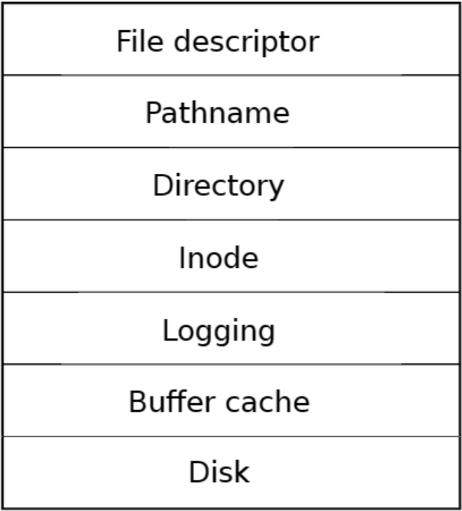
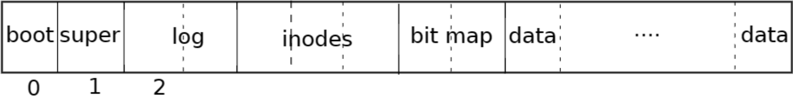

# BirdOS——文件系统

**目录：**

一、基本功能

二、改进与创新


## 一、基本功能

### 1.1 层次结构

xv6文件系统分为七层：

1. **Disk层**：读取和写入virtio硬盘上的块。
2. **Buffer cache层**：缓存磁盘块并同步访问，确保每次只有一个进程可以修改数据。
3. **Logging层**：将多个块的更新包装为事务，崩溃时保证数据一致性。
4. **Inode层**：每个文件通过索引结点（i-number）表示，保存文件数据的块。
5. **Directory层**：目录实现为索引结点，包含目录项（文件名和inode编号）。
6. **Pathname层**：解析分层路径名，通过递归查找。
7. **File descriptor层**：抽象Unix资源（如文件、管道等），简化应用程序使用。



### 1.2 磁盘划分

在xv6文件系统中，为了存储索引节点和数据块的位置，文件系统将磁盘划分为多个部分。具体布局如下：

1. **块0**：保留用于引导扇区，文件系统不使用此块。
2. **块1**：称为超级块，包含整个文件系统的元数据，如文件系统的大小（以块为单位）、数据块数量、索引节点数量以及日志块数量等文件系统布局信息。
3. **日志区域**：从块2开始的区域用于存储日志，用于确保文件系统的事务性和一致性。
4. **索引节点区**：日志区域之后是索引节点区，每个磁盘块中存储多个索引节点（inode）。
5. **位图块**：位图块紧随索引节点区，用于跟踪文件系统中数据块的使用情况，标记哪些数据块已被分配，哪些是空闲的。
6. **数据块**：剩余的磁盘块是数据块，用于存储文件或目录的实际内容。每个数据块要么被位图标记为已分配，要么标记为空闲。

超级块的内容是由一个名为`mkfs`的程序生成的，该程序负责构建文件系统的初始结构，并填充超级块信息。



### 1.3 逻辑结构与物理结构

xv6文件系统的**逻辑结构**和**物理结构**相互对应。逻辑结构是文件系统的抽象层，主要包括目录、文件和路径名等概念；物理结构是文件系统在磁盘上的具体布局，主要包括数据块、索引节点（inode）、日志等。

- **逻辑结构**：包括目录、文件和路径名。文件由索引节点（inode）表示，每个文件或目录都有一个唯一的inode编号。目录是特殊类型的文件，包含一组目录项，每个目录项有文件名和对应的inode编号。路径名通过递归方式解析，指向具体的文件或目录。
- **物理结构**：包括磁盘上分配的块。磁盘分为多个区域：引导块、超级块、日志区域、索引节点区域、位图块、数据块等。逻辑结构通过物理结构实现，文件的索引节点和数据块存储在物理磁盘的特定位置，路径名解析最终对应到这些物理位置。

### 1.4 文件描述符、file结构体、索引节点inode和盘块关系

在xv6中，文件描述符、`file`结构体、索引节点（inode）和磁盘块（block）之间有明确的关系：

- **文件描述符（File Descriptor）**：每个进程通过文件描述符与打开的文件进行交互。文件描述符是进程打开文件时返回的整数，用于标识进程与文件的访问。
- **`file`结构体**：每个文件描述符都对应一个`file`结构体，`file`结构体中包含文件的相关信息，如指向`inode`的指针、文件当前的偏移量、文件状态等。`file`结构体在内核中用于管理打开的文件。
- **索引节点（inode）**：每个文件都有一个对应的索引节点（inode），它存储文件的元数据，包括文件的大小、权限、创建时间、最后访问时间、数据块的位置等。索引节点通过`inode`结构体表示。
- **磁盘块（Block）**：磁盘上的数据块用于存储文件的实际内容或索引节点。每个文件的内容被分割成多个数据块，存储在磁盘上；而文件的索引节点则存储在特定的索引节点区域。磁盘块通过位图来管理，指示哪些块是空闲的，哪些块已经分配给文件。

文件描述符指向`file`结构体，`file`结构体通过`inode`指向磁盘上的数据块，`inode`存储文件的元数据，而数据块保存文件的实际内容。

### 1.5 Block块管理

在xv6文件系统中，**块（Block）管理**负责跟踪和管理磁盘上的所有数据块和空闲块。xv6使用位图（Bitmap）来管理块的使用情况。

- **位图（Bitmap）**：位图用于表示磁盘块的分配情况。每个比特位对应一个磁盘块，值为1表示该块已分配，值为0表示该块为空闲状态。通过位图，系统能够快速判断某个磁盘块是否已被使用，以及找到空闲块以供分配。
- **数据块**：文件的数据存储在数据块中，每个数据块存储一定数量的字节（通常为512字节或4KB）。数据块通过位图进行管理，确保文件系统能有效地分配和回收块。
- **块分配**：文件系统通过块分配算法（如顺序分配或链式分配）从位图中选择空闲块，并将其分配给文件。当文件写入数据时，系统为文件分配新的数据块，并更新位图。
- **块回收**：当文件删除或文件系统需要清理空间时，系统会回收不再使用的块，并将其标记为可用（在位图中设置为0）。

### 1.6 Inode保存数据的结构

在xv6文件系统中，**inode**是文件的核心数据结构之一，用于存储文件的元数据（如大小、权限、创建时间等）和数据块的指针。文件的数据分布在磁盘上的多个数据块中，xv6采用两层结构来存储文件数据：

1. **直接指针（Direct Pointers）**：每个inode包含12个直接指针（通常为12个32位指针），这些指针直接指向文件数据块。当文件小到足以放入这些数据块时，所有数据块直接通过inode中的指针访问。
2. **间接指针（Indirect Pointers）**：
   - **一级间接指针**：如果文件的数据超过了12个数据块，则使用一个一级间接指针。该指针指向一个数据块，这个数据块存储更多的数据块指针，进而指向文件的数据。
   - **二级间接指针**：如果文件更大，一级间接指针仍不足以存储所有的数据块指针，则使用二级间接指针。该指针指向一个数据块，这个数据块包含一级间接指针的地址，从而间接指向更多的数据块。

通过这种**两层的结构**（直接指针和间接指针），xv6能够有效地管理大文件的存储，使文件系统既能处理小文件，也能支持大文件的存储需求。这种结构提供了较好的空间利用率，并且在文件增大时提供了扩展性。

好的，我会根据每个模块提供更详细的描述，使每个模块的实现更加清晰。以下是每个模块的详细内容，按 Markdown 格式呈现。

------

### 1.7 超级块（Superblock）

超级块（Superblock）是文件系统的核心元数据，它描述了文件系统的布局、容量、状态等关键信息。每个文件系统只有一个超级块，存储在磁盘的固定位置（在 xv6 中是第 2 块）。超级块的主要作用是提供有关文件系统结构的基本信息，帮助系统在启动时识别文件系统并进行相应的初始化。

**实现**：

```c
struct superblock
{
  uint magic;      // 文件系统魔数，用于验证文件系统的有效性，必须为 FSMAGIC
  uint size;       // 文件系统镜像的总大小（以块为单位）
  uint nblocks;    // 数据块的数量
  uint ninodes;    // inode 的数量
  uint nlog;       // 日志块的数量
  uint logstart;   // 日志块的起始位置
  uint inodestart; // inode 块的起始位置
  uint bmapstart;  // 空闲位图块的起始位置
};
```

- **magic**：文件系统标识符，确保文件系统的有效性和识别。每个文件系统的超级块中都应该包含一个特定的魔数（在 xv6 中是 `FSMAGIC`），如果这个值不匹配，则说明文件系统无效。
- **size**：文件系统的总大小（以块为单位）。表示文件系统的容量，包括数据块、inode 块、日志块等。
- **nblocks**：文件系统中的数据块数量，用来存储实际的文件数据。
- **ninodes**：inode 的数量，每个文件和目录都有一个对应的 inode。
- **nlog**：日志块的数量，用于事务日志的管理。
- **logstart**：日志块的起始位置，指示文件系统的日志存储区域。
- **inodestart**：inode 块的起始位置，表示 inode 存储区域的位置。
- **bmapstart**：位图块的起始位置，位图用于跟踪哪些数据块是空闲的，哪些已经被使用。

通过超级块，文件系统可以快速了解磁盘布局和资源分布，是文件系统运行的基础。

------

### 1.8 索引节点（Inode）

在 xv6 中，每个文件都由一个对应的 **inode** 结构体来表示。inode 存储了关于文件的元数据（如文件类型、权限、大小、数据块位置等）。每个文件都有一个唯一的 inode 编号（i-number），系统通过 inode 来管理文件的内容和属性。

**实现**：

```c
struct dinode
{
  char mode;                // 文件权限
  char type;                // 文件类型（例如普通文件、设备文件等）
  short major;              // 主设备号，仅对设备文件有效
  short minor;              // 次设备号，仅对设备文件有效
  short nlink;              // 硬链接数，表示有多少目录项指向此 inode
  uint size;                // 文件的大小（字节）
  uint addrs[NDIRECT + 2];  // 数据块的地址，前 11 个是直接地址，接下来的是间接地址
};
```

- **mode**：文件的权限标志，表示文件的访问控制信息，例如可读、可写、可执行等。
- **type**：文件的类型，例如普通文件、设备文件、目录等。
- **major** 和 **minor**：设备文件的主设备号和次设备号。对于普通文件，这两个字段无效。
- **nlink**：硬链接的数量，表示有多少目录项指向该 inode。文件删除时，只有当所有硬链接都删除后，inode 和数据块才会被释放。
- **size**：文件的大小（字节数），指示文件内容的实际大小。
- **addrs**：文件的数据块地址数组。前 11 个地址为直接地址指针，接下来是一个单级间接地址和二级间接地址，指向更多的块。这些地址组成了文件的数据块映射。

通过 inode，文件系统可以知道文件的各种属性和文件数据存储位置。

------

### 1.9 文件描述符（File Descriptor）

文件描述符（File Descriptor）是内核中用来表示打开文件的索引。每个进程在打开文件时，内核会为该文件分配一个文件描述符。文件描述符指向内存中的 `file` 结构体，用户通过文件描述符来进行文件的读写操作。

**实现**：

```c
struct file
{
  enum { FD_NONE, FD_PIPE, FD_INODE, FD_DEVICE, FD_SOCK } type; // 文件类型
  int ref;                   // 引用计数
  char readable;             // 是否可读
  char writable;             // 是否可写
  struct pipe *pipe;         // 若是管道文件，指向管道结构体
  struct inode *ip;          // 若是普通文件或设备文件，指向 inode 结构体
  struct sock *sock;         // 若是套接字，指向 sock 结构体
  uint off;                  // 文件的偏移量（对于 inode 类型）
  short major;               // 设备主设备号（对于设备文件）
};
```

- **type**：文件类型，用于区分普通文件、管道、设备文件和套接字。
- **ref**：文件的引用计数。文件描述符的引用计数跟踪了有多少进程打开了此文件，文件在关闭时会递减该计数。
- **readable** 和 **writable**：表示文件是否可读和可写。如果为 `0`，则表示不可读或不可写。
- **pipe**：如果文件描述符指向的是管道，`pipe` 字段指向管道的结构体。
- **ip**：如果文件描述符指向的是一个常规文件或设备文件，`ip` 字段指向该文件或设备的 inode 结构体。
- **off**：文件的读写偏移量，表示文件的当前读写位置。
- **major**：设备文件的主设备号，用于标识设备。

文件描述符在进程的文件操作中起着重要作用，进程通过文件描述符来访问文件和设备。

------

### 1.10 `file` 结构体

`file` 结构体在 xv6 中是内核用来表示打开文件的关键数据结构。每当一个进程打开文件时，内核会为该文件分配一个 `file` 结构体并分配一个文件描述符。`file` 结构体包括文件的类型、引用计数、读写权限、偏移量等信息。

**实现**：

```c
struct file
{
  enum { FD_NONE, FD_PIPE, FD_INODE, FD_DEVICE, FD_SOCK } type; // 文件类型
  int ref;                   // 引用计数
  char readable;             // 是否可读
  char writable;             // 是否可写
  struct pipe *pipe;         // 若是管道文件，指向管道结构体
  struct inode *ip;          // 若是普通文件或设备文件，指向 inode 结构体
  struct sock *sock;         // 若是套接字，指向 sock 结构体
  uint off;                  // 文件的偏移量（对于 inode 类型）
  short major;               // 设备主设备号（对于设备文件）
};
```

- **type**：通过文件的类型，文件描述符可以区分不同类型的文件，如普通文件、管道、设备文件和套接字等。
- **ref**：引用计数，用于跟踪文件描述符的引用情况，确保文件在不再使用时能够被正确释放。
- **readable/writable**：标识文件是否具有读写权限。
- **pipe**：指向管道的结构体，文件描述符通过该字段访问管道。
- **ip**：指向 inode，文件描述符通过该字段访问文件的 inode，从而获取文件的元数据。
- **off**：当前的文件偏移量，指示文件操作的当前读写位置。
- **major**：设备文件的主设备号。

------

### 1.11 磁盘块（Block）

磁盘块是文件系统的基本存储单位，每个块存储一定量的数据。在 xv6 中，每个块的大小是 1024 字节。磁盘块被用于存储文件数据、inode、日志等。文件系统通过管理磁盘块来存储和管理文件。

**实现**：

```c
#define BSIZE 1024 // 块大小定义为 1024 字节
```

每个磁盘块可以存储 1024 字节的数据，它们是文件系统的最小分配单位。在 xv6 中，所有文件、目录、日志和索引节点的数据都以块为单位进行管理。

------

### 1.12 位图（Bitmap）

位图用于管理文件系统的空闲空间，尤其是磁盘块和 inode 的使用情况。每个位置代表一个块或 inode 是否被占用，`0` 表示该位置未使用，`1` 表示该位置已被占用。

**实现**：

```c
// 每个位图都有一个与文件系统大小相对应的位图块
#define BITMAPSIZE 256 // 位图的大小
```

位图帮助文件系统有效地管理磁盘空间，提供了一个便捷的方式来判断一个块或 inode 是否已被分配。